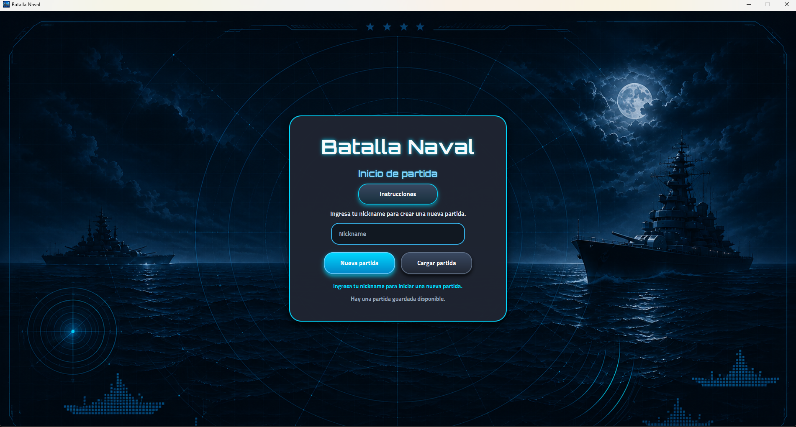
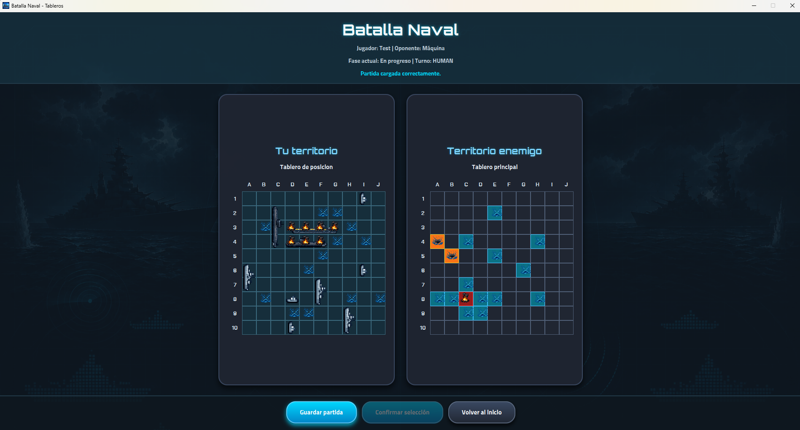

# Naval Battle Game

<p align="center">
    
</p>

<p align="center">
    
</p>

Naval Battle Game is an interactive desktop application inspired by the classic Battleship game.

The project was developed with **Java 17**, **JavaFX**, **Maven**, **JUnit 5**, **CSS** and **Git/GitHub** as part of an academic project for Event-Oriented Programming.
By:

- Juan Pablo Lozano Restrepo - 2521505
- Daniel Fernando Vallejo Cabrera - 2343154

The game allows the player to place a complete fleet, confirm the ship selection, attack the enemy board, save and load the game, and play against an artificial opponent that uses a basic smart shooting strategy.

## 🗝️ Key Features

- **Interactive Gameplay**: Classic Battleship mechanics adapted to a JavaFX desktop application.
- **Human vs Machine Mode**: The player competes against an artificial opponent.
- **Fleet Placement System**:
  - Select ships with left click.
  - Rotate the selected ship with right click.
  - Place ships on the player board.
  - Move and rotate ships before confirming the fleet.
- **Manual Fleet Confirmation**: The game only starts when the player confirms the ship selection.
- **Machine Fleet Placement**: The machine places its fleet automatically.
- **Smart Machine Strategy**: The artificial player uses a Strategy pattern to prioritize shots around previously hit cells.
- **Background Machine Turn**: The machine turn runs using a JavaFX `Task`, improving the user experience.
- **Save and Resume**:
  - The game state is saved using serialization.
  - Player statistics are stored in a flat file.
  - A saved game can be loaded from the main screen.
- **Instructions Dialog**: The main screen includes an instructions button that explains how to play.
- **Custom Visual Design**:
  - Dark naval HUD interface.
  - Custom backgrounds for the main screen and battle screen.
  - Application icon.
  - Custom fonts.
  - Styled buttons, cards, panels and board cells.
  - Hover highlight for board interaction.
- **Unit Testing**: The project includes unit tests for model, services, persistence and strategy.

## 💻 Tech Stack

- ☕ [Java](https://docs.oracle.com/en/java/) - Main Programming Language
- 🏖️ [JavaFX](https://openjfx.io/) - Framework for GUI development
- 🎨 [CSS](https://www.w3.org/Style/CSS/) - For custom styling
- ✏️ [Git](https://git-scm.com/) - Version control manager

## 🎮 How to Play

1. Enter a nickname on the main screen.
2. Click **Nueva partida** to start a new game.
3. Select a ship from the available ships panel.
4. Use left click to place the ship on your board.
5. Use right click to rotate the selected ship.
6. You can move or rotate your ships before starting the battle.
7. Once all ships are placed, click **Confirmar selección**.
8. Attack the enemy board by clicking on a cell.
9. If you hit or sink a ship, you keep your turn.
10. If your shot lands in water, the turn passes to the machine.
11. The winner is the player who sinks the entire enemy fleet first.

## 🧭 Controls

| Action                        | Control                                     |
| ----------------------------- | ------------------------------------------- |
| Select a ship                 | Left click on an available ship             |
| Rotate selected ship          | Right click                                 |
| Place selected ship           | Left click on the player board              |
| Move an already placed ship   | Drag and drop                               |
| Rotate an already placed ship | Right click on the placed ship              |
| Shoot                         | Left click on the enemy board               |
| Save game                     | Click **Guardar partida**                   |
| Load game                     | Click **Cargar partida** on the main screen |
| View instructions             | Click **Instrucciones** on the main screen  |

## 🚢 Fleet

The game uses the classic Battleship fleet distribution:

| Ship             | Quantity | Size |
| ---------------- | -------: | ---: |
| Aircraft Carrier |        1 |    4 |
| Submarine        |        2 |    3 |
| Destroyer        |        3 |    2 |
| Frigate          |        4 |    1 |

## 💾 Persistence

The project uses two persistence mechanisms:

- **Serialization**: Saves and loads the complete game state.
- **Flat File**: Stores basic player statistics.

Generated files are stored in the `data` folder.

The serialized file stores the current match state, including players, boards, ships, turn, phase and shot history.

The flat file stores basic player statistics such as nickname, game phase and sunk ships.

## 🧠 Design Pattern Implemented

The project implements the **Strategy** design pattern for the artificial player shooting behavior.

```text
ShotStrategy
├── RandomShotStrategy
└── SmartShotStrategy
```

This allows the machine to change its shooting behavior without modifying the main game service or the JavaFX controller.

## 🧪 Tests

The project includes unit tests for:

- Board creation.
- Coordinates.
- Ships.
- Ship placement.
- Shooting logic.
- Turn handling.
- Game state validation.
- Custom exceptions.
- Serialization.
- Flat file persistence.
- Smart shot strategy.

Current test result:

```text
Tests run: 37
Failures: 0
Errors: 0
Skipped: 0
```

To run the tests:

```bash
mvn clean test
```

## 🚀 How to Run

1. Clone the repository:

```bash
git clone https://github.com/sodanielstereo/battleship.git
```

2. Enter the project folder:

```bash
cd battleship
```

3. Compile the project:

```bash
mvn clean compile
```

4. Run the tests:

```bash
mvn clean test
```

5. Run the application:

```bash
mvn javafx:run
```

## 🗺️ Future Ideas

- Add sound effects for shots, hits and sunk ships.
- Add more visual animations for attacks and machine turns.
- Add a local multiplayer mode.
- Improve the statistics screen with more detailed game history.
- Add difficulty levels for the artificial player.
- Package the game as an executable JAR or installer.

## ✅ Current Status

The project currently compiles, runs and passes all unit tests.

It includes core gameplay, JavaFX interface, persistence, custom exceptions, data structures, Strategy pattern, background machine turns, custom visual assets and unit testing.

## Source Icons
The icons for shooting, hitting, and sinking were taken from the page: https://icons8.com
